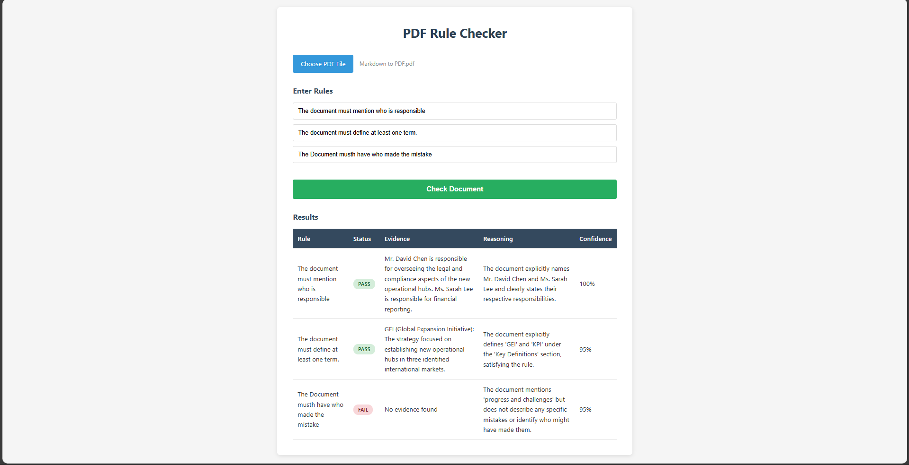

Here is the transformed text in your writing pattern: simple, direct, slightly informal, straight-to-the-point, no overly polished corporate tone.

---

# NIYAMR AI – PDF Rule Checker




## Overview

This is a very small full-stack app where the user uploads a PDF (2–10 pages), writes up to three rules, and the backend uses Google Gemini (`@google/genai`) to check each rule. For every rule it returns: pass/fail, evidence, reasoning, and confidence.

## Features

* Upload PDF up to 10 MB
* Add up to three rules (backend can take more)
* Backend built with Express + TypeScript, endpoint: `/api/documents/validate`
* Uses Gemini 2.5 Flash to evaluate rules and return structured JSON
* React frontend (CRA) with simple CSS and a results table showing pass/fail badges, loading, and error states

## Tech Stack

| Layer    | Stack                                        |
| -------- | -------------------------------------------- |
| Frontend | React 18 (CRA), fetch, raw CSS               |
| Backend  | Node.js 20+, Express 5, Multer, pdf-parse    |
| AI Model | Gemini 2.5 Flash (`@google/genai`)           |
| Language | TypeScript (backend) + JavaScript (frontend) |

## How It Works

1. User uploads a PDF and enters rules.
2. Frontend sends `multipart/form-data` to `/api/documents/validate` with PDF + rules JSON.
3. Backend extracts PDF text, sends text + rule to Gemini, then formats the response.
4. API returns `{ results: [...] }` with rule, status, evidence, reasoning, confidence.
5. Frontend shows the table with the results.

## Requirements

* Node.js 20+
* npm 9+
* Gemini API key

## Backend Setup

```bash
cd backend
cp .env.example .env
npm install
npm run dev
```

`.env`:

```
PORT=4000
GEMINI_API_KEY=your_real_key
```

### Backend Scripts

* `npm run dev` – dev mode with nodemon
* `npm run build` – compile to `dist/`
* `npm start` – run compiled code

## Frontend Setup

```bash
cd frontend
cp .env.example .env
npm install
npm start
```

`.env`:

```
REACT_APP_API_URL=http://localhost:4000
```

## Run Everything

1. Start backend (`npm run dev`).
2. Start frontend (`npm start`).
3. Go to `http://localhost:3000`, upload a PDF, add rules, and hit **Check Document**.

## API

`POST /api/documents/validate`

**Request (multipart/form-data):**

* `file` → PDF
* `rules` → JSON array or newline-based list

**Response:**

```json
{
  "results": [
    {
      "rule": "Document must mention a date.",
      "status": "pass",
      "evidence": "Found on page 1: 'Published 2024'",
      "reasoning": "Document includes a publication year.",
      "confidence": 92
    }
  ]
}
```
